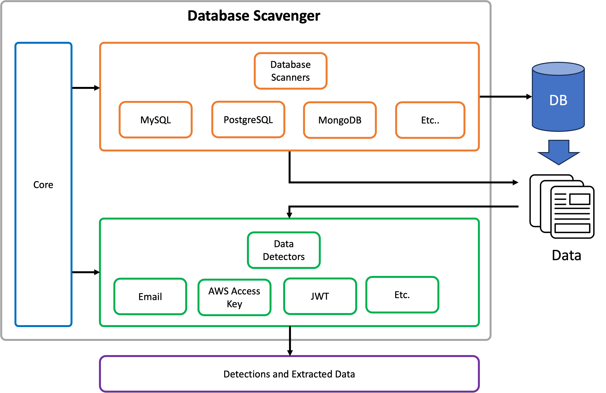

# Cycle 10: TBD


## Requirements
The main requirements of the project that influenced the functionality and design are as follows:

  * TBD

## Design
The tool was developed in Python for expediency's sake.



## Video
A demonstration video can be found on YouTube here:

[https://youtu.be/TBD](https://youtu.be/TBD)


## Dependencies and Setup
The project has the following dependencies:

* [Python 3](https://www.python.org/): >= 3.11.x
* [Pip](https://pip.pypa.io/en/stable/): >= 23.0


### Python Dependencies
Install the Python dependencies using the following command:

```bash
pip install -r requirements.txt
```

## Usage
This section shows the usage of the tool:

```bash
./db-secret-scanner.py -t mysql -s "localhost" -d csc842 -u admin -p admin -v
```

```bash
./db-secret-scanner.py -t mongodb -s "localhost" -d csc842 -u admin -p admin -v
```

### Help
The program help can be shown using the `-h` flag.

```bash

```

TBD
