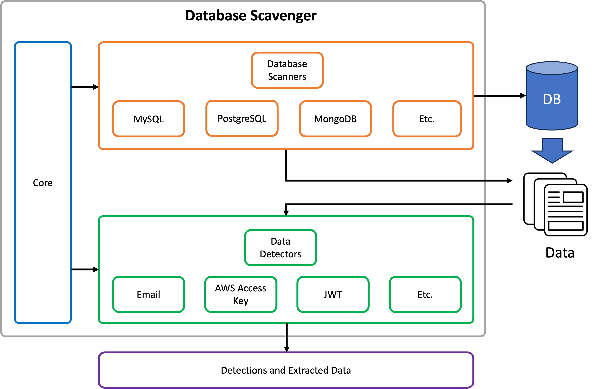

# Cycle 10: Databases Scavenger
The Database Scavenger is tool / framework that searches Databases for data of interest.  Examples include AWS Access Keys, emails, Social Security numbers, etc.  The tool supports multiple databases and is easily extendable to search for various kinds of data.  The tool also has the ability to extract the data it identifies as interesting.

The objective is to quickly identify and extract data from a database that is unfamiliar to you, either to understand if your database has sensitive data (defensive cyber) or to find an exfiltrate sensitive data (offensive cyber.).

The currently supported databases include:

  * MySQL
  * PostgreSQL
  * MongoDB


## Requirements
The main requirements of the project that influenced the functionality and design are as follows:

  * The tool must support multiple SQL and NoSQL databases.
  * The tool must be easily extendable to add support for additional databases over time.
  * The tool must allow searching for all kinds of interesting data using a variety of mechanisms.
  * The tool must support easily adding detectors for additional data over time.
  * The tool must allow the user to extract the data it finds from the database.

## Design
The tool was developed in Python for expediency's sake.



## Video
A demonstration video can be found on YouTube here:

[https://youtu.be/TBD](https://youtu.be/TBD)


## Dependencies and Setup
The project has the following dependencies:

* [Python 3](https://www.python.org/): >= 3.11.x
* [Pip](https://pip.pypa.io/en/stable/): >= 23.0


### Python Dependencies
Install the Python dependencies using the following command:

```bash
pip install -r requirements.txt
```

## Usage
This section shows the usage of the tool:


### Help
The program help can be shown using the `-h` flag.

```bash
./db-scavenger.py -h
usage: db-scavenger [-h] -t TYPE [-n SAMPLE_SIZE] -s SERVER -d DATABASE -u USERNAME -p PASSWORD [-e EXTRACT] [-v]

A tool that searches a database for sensitive data and supports extracting data of interest.

options:
  -h, --help            show this help message and exit
  -t TYPE, --type TYPE  Specifies the type of database you are connecting to
  -n SAMPLE_SIZE, --sample-size SAMPLE_SIZE
                        Specifies the number of records from each table to query to detect data
  -s SERVER, --server SERVER
                        Specifies the database server to connect to
  -d DATABASE, --database DATABASE
                        Specifies the database name to connect to
  -u USERNAME, --username USERNAME
                        The username to log into the database with
  -p PASSWORD, --password PASSWORD
                        The password to log into the database with
  -e EXTRACT, --extract EXTRACT
                        Extracts detected data from the database to a specified file
  -v, --verbose         Triggers additional output
```

### MySQL

The example below shows connecting to a MySQL Database.

```bash
./db-scavenger.py -t mysql -s "localhost" -d csc842 -u admin -p admin -v
```

### MongoDB

The example below shows connecting to a MySQL Database.

```bash
./db-scavenger.py -t mongodb -s "localhost" -d csc842 -u admin -p admin -v
```

### PostgreSQL

The example below shows connecting to a PostgreSQL Database.

```bash
./db-scavenger.py -t postgres -s "localhost" -d csc842 -u admin -p admin -v
```
