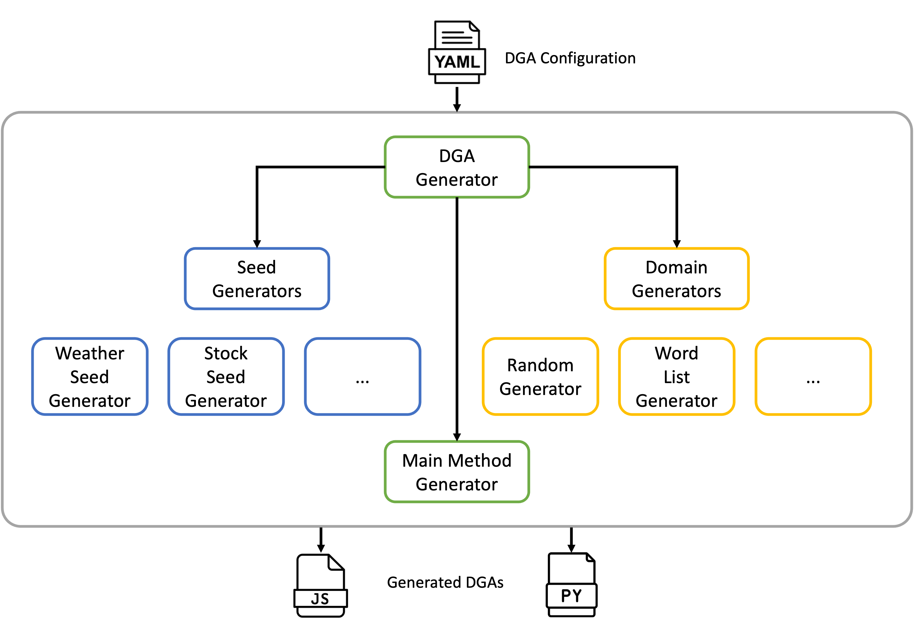

# Cycle 2: Domain Generation Algorithm Builder
This project provides a [Domain Generation Algorithm](https://en.wikipedia.org/wiki/Domain_generation_algorithm) (DGA) Builder.  DGAs are often used by malware to connect back to a command and control server.  The DGA Builder simplifies and automates building DGAs across multiple languages.  A configuration file specifies how the DGA should be constructed. Given a configuration file, the DGA Builder will generate code that implements the DGA in multiple languages.  The goal of the project was to make it easy to rapidly develop high-quality DGAs and to be able to update them quickly if the current DGA gets blocked. Another motivation for the project was cases where malware and the corresponding C2 infrastructure are developed in different languages. In order to automate domain registration it is useful to have the same DGA implemented in multiple languages.

## Requirements
The main requirements of the project that influenced the functionality and design are as follows:

  * The program must be able to generate DGAs in multiple languages.
  * The program must support a configuration file that specifies how the DGA will be built.
  * DGAs generated from the same configuration (in different languages) must compute the same domains.
  * Multiple runs using the same configuration file should produce the same output.
  * DGAs must support changing the generated domains over time (time-based).
  * DGAs must pseudorandom, but be deterministic.
  * The program must support generating an external random seed, to seed the pseudorandom algorithms.
  * The program must be modular and extendable and allow easy addition of:
    * New methods of obtaining a random seed.
    * New methods of generating random domain names.
    * Additional programming languages.

A specific non-requirement was code obfuscation.  While DGA's are often obfuscated when included in malware, there are existing language-specific tools that perform obfuscation.

## Design
The high-level architecture for the project is depicted below.  A [configuration file](#config-file) is fed to the main script ([dga-builder.py](dga-builder.py)).  The [DgaGenerator](dga/dga_generator.py) class provides the main logic for building DGAs.  The [CodeGenerator](dga/codegen.py) interface defines the interface for all modules that generate code and implementers must implement code generation methods for each supported language.

The [seed](dga/seed) directory contains plugins that generate random seeds.  Modules added to this directory are automatically available to use via the configuration file without any other code changes.  Similarly, the [domain](dga/domain) directory contains plugins for generating domain names.



## Video
A demonstration video can be found on YouTube here:

http://youtube.com


## Dependencies and Setup
The project has the following dependencies:

* [NodeJS](https://nodejs.org/en): >= 18.0
* [Yarn](https://yarnpkg.com/): => 1.22.x
* [Python 3](https://www.python.org/): => 3.11.x
* [Pip](https://pip.pypa.io/en/stable/): => 23.0

### Python Dependencies
Install the Python dependencies using the following command:

```bash
pip install -r requirements.txt
```
### Node Dependencies (Optional)
If you want to use the convenience script to obfuscate the generated JavaScript code, you must install the node dependencies.

```bash
yarn install
```


## Running
The DGA Builder can be run by executing the [dga-builder.py](dga-builder.py) script.  The command line script takes a configuration file as an input as well as the directory to output generated DGAs to.

The command line script has a built-in help menu that can be displayed using `-h` option.

```bash
./dga-builder.py -h
usage: dga-builder [-h] config output

A utility for building Domain Generation Algorithms

positional arguments:
  config      The config file that determines how the DGAs will be constructed.
  output      The directory to output files to.

options:
  -h, --help  show this help message and exit
```

The DGA Builder can be run using one of the example config files located in the [example-config](example-config) directory.

```bash
./dga-builder.py example-configs/weather-words.yml out

JavaScript DGA output to: out/dga.js
Python DGA output to: out/dga.py

```

### Printing Results
Two helper script files have been included that will use the generated code and print out the domains produced by the DGAs.

To test the Python DGA, use the [print-domains.js](print-domains.js) file and pass it the path to the generated JavaScript as an argument.

```bash
./print-domains.js out/dga.js
o1t8z425be.re
cdoapn09os.re
m145yuttig.ru
7yix4z5ha-.ru
e7bm05ha-2.xyz
j19pst4dq4.xyz
-iqlns4pif.za
rl02br4ois.za
6h3v9ea1p6.re
9crinklkkt.re
5d1v2puzo9.ru
2v5c3cgszm.ru
yzvyhsyo5x.xyz
zvyhsyo5xm.xyz
bq6jkithiu.za
vzp9qym5qh.za
```

To test the Python DGA, use the [print-domains.py](print-domains.py) file and pass it the path to the generated python file WITHOUT the `.py` extension as an argument.

```bash
./print-domains.py out/dga   
o1t8z425be.re
cdoapn09os.re
m145yuttig.ru
7yix4z5ha-.ru
e7bm05ha-2.xyz
j19pst4dq4.xyz
-iqlns4pif.za
rl02br4ois.za
6h3v9ea1p6.re
9crinklkkt.re
5d1v2puzo9.ru
2v5c3cgszm.ru
yzvyhsyo5x.xyz
zvyhsyo5xm.xyz
bq6jkithiu.za
vzp9qym5qh.za
```


## Config File

```yaml
# Specifies which top-level domains to generate domains within.
top-level-domains:
  - re
  - ru
  - xyz
  - za

# How many domains to generate per top-level domain.
domains-per-tld: 2

# How frequently should the domains be rotated. Valid values are 'week' and 'month'.
# Whichever value is chosen, the DGAs will use the current and previous periods so
# that two periods are always active.
frequency: week  

# Specifies the method that should be used to obtain the random seed for domain
# generation.
#
# Note: Only one seed method should be used, although all are shown here together.
seed:

  # Use historical stock price to generate domains. The stock symbol is specified.
  stock:
    symbol: AAPL
  
  # Use historical weather information to generate domains. The method takes a
  # latitude and longitude (in decimal format) of a location to get the historical
  # weather for, along with a metric to use. Valid metrics are:
  #   - temperature_2m_max
  #   - temperature_2m_min
  weather:
    lat: 52.52
    lng: 13.41
    metric: temperature_2m_max

# Specifies the method that should be used to generate domain names given the
# random seed.
#
# Note: Only one seed method should be used, although all are shown here together.
domain:

  # Generates pseudorandom domains of a specified length.
  random:
    length: 10

  # Generates domains from a word list.
  domain:
   words:
     count: 7
     separator: true
     word-list:
       - blue
       - room
       - orca
       - base
       - down
       - fool
       - gold
       - grow
       - tide
       - ball
       - lift
       - ogre
       - left
       - self
       - fire
       - root
       - fast
       - slid
       - four
       - dirt
       - pray

# Configures language specific options.
languages:
  javascript:
    function-name: generateDomains
  python:
    function-name: generate_domains
```
