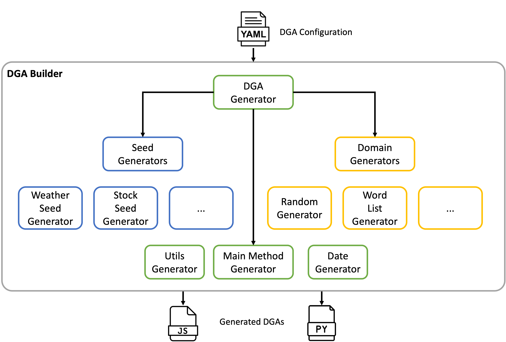

# Cycle 2: Domain Generation Algorithm Builder
This project provides a [Domain Generation Algorithm](https://en.wikipedia.org/wiki/Domain_generation_algorithm) (DGA) Builder.  DGAs are often used by malware to connect back to a command and control server.  The DGA Builder simplifies and automates building DGAs across multiple languages.  A configuration file specifies how the DGA should be constructed and the DGA Builder then generates code to implement a DGA using those options.

The project was built using Python 3.11.


## Requirements

## Design



## Video
A demonstration video can be found on YouTube here:

http://youtube.com


## Running
The generator can be run using one of the example config files located in the [example-config](example-config) directory.

```bash
./dga-builder.py example-configs/weather-words.yml out

JavaScript DGA output to: out/dga.js
Python DGA output to: out/dga.py

```

## Config File
