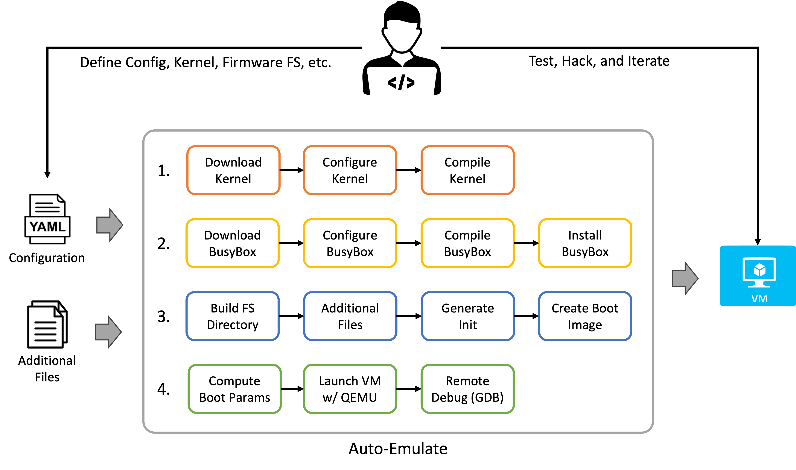

# Cycle 4: Auto-Emulate
The Auto Emulate tool automates booting a specified Linux Kernel along with a configured root filesystem.  The motivation for the tool was to increase the efficiency of Linux-based firmware reverse engineering, as well as Linux Kernel / Kernel module exploitation.  In both cases, it is common to need to compile a Linux Kernel, build a root file system, boot a virtual machine with those, and then remote debug.

For those new to the task, this actually requires quite a few complicated and knowledge of several tools.  Even for those who know how to do this, it requires a bunch manual work.  It is also often quite cumbersome to iterate fast.  So the goal of this tool was to provide the minimum viable product (MVP) of a tool that automates all the sets you need to get a specific kernel and root files system up and running.  The tool also supports easy configuration of anti-exploitation kernel features like KASLR, SMEP/SMAP, Page Table Isolation, etc. which are handy to turn on and off when first reversing/exploiting something.

Auto-Emulate uses a declarative configuration file that specifies how the VM should be configured, in the spirit of Infrastructure as Code.


## Requirements
The main requirements of the project that influenced the functionality and design are as follows:

  * The ability to select whatever Linux Kernel version is relevant to the system you are attacking or reverse engineering.
  * The tool must support booting a root file system extracted from device firmware.
  * The tool must be able to support creating a basic file system and allow for specific kernel modules and/or code to attack those modules to be loaded.
  * The tool must support remote debugging via GDB.
  * The entire process must be automated from end-to-end, while also allowing the ability to rapidly rebuild portions of the system during iteration.
  * The tools should be configuration file driven, as to follow an "Infrastructure as Code" approach, rather than support dozens of options.
  * The architecture should allow for easily adding options and configurations over time, as it is likely that edge cases will be encountered for different firmware.

## Design
The project was developed in Python. However, the Python code largely orchestrates several other tools like GCC, make, and QEMU. Which must be installed on the system.  The tool is roughly grouped into four modules.  

  1. The first module is responsible for downloading and building the Linux Kernel.  
  2. The second module is set up to build a file system based on Busy Box, in the case where a firmware image has not been provided.  This is largely useful for Kernel / Kernel Module hacking.
  3. The third module builds a bootable root file system image from Busy Box, a supplied firmware image, etc.
  4. The fourth module is responsible for booting the virtual machine.



A goal of the project was to automate and accelerate iteration on reverse engineering. As such, the tool will detect what steps have already been accomplished. For example, once the kernel source has been downloaded, it doesn't need to be downloaded again.  Once the kernel has been extracted and configured (e.g. make config), then it need not be configured again.  Once the kernel has been compiled, it need not be compiled again... etc.  The same applies to the root filesystem.  However, if the user needs to change the configuration of the kernel, the tool does allow manual rebuilding of particular steps in the process.  This allows for flexibility, while greatly speeding up the happy path.


## Video
A demonstration video can be found on YouTube here:

[https://youtu.be/bNNDqdya3Sw](https://youtu.be/bNNDqdya3Sw)


## Dependencies and Setup
The project has the following dependencies:

* [Python 3](https://www.python.org/): >= 3.11.x
* [Pip](https://pip.pypa.io/en/stable/): >= 23.0
* [QEMU](https://www.qemu.org/): >= 7.2
* [GCC](https://gcc.gnu.org/): >= 12.x
* [Make](https://www.gnu.org/software/make/): >= 4.x

### Python Dependencies
Install the Python dependencies using the following command:

```bash
pip install -r requirements.txt
```

## Usage
This section shows the usage of the tool:

### Help
The program help can be shown using the `-h` flag.

```bash
usage: auto-emulate [-h] [-c CONFIG] [{config,build-kernel,build-fs,boot}]

A simply utility to automate building Linux VMs for kernel hacking and firmware reversing

positional arguments:
  {config,build-kernel,build-fs,boot}

options:
  -h, --help            show this help message and exit
  -c CONFIG, --config CONFIG
                        The configure file to use.
```

### Config file
By default, the tool will look for the `vm-config.yml` file in the current directory.  Alternatively, a configuration file can be specified with the `-c` command.

```bash
./auto-extract.py -c myconfig.yml
```

### Commands
The tool allows the user to specify a command to execute.  For example,

```bash
./auto-emulate.py boot
```

The available commands are:

  * **boot**: This is the default option and will perform all necessary steps to boot the VM.  However, the boot command will not redo any previous work. For example, if the Kernel is already built, it will not be rebuilt.
  * **config**: Config will cause all configuration files (e.g. make config) to be generated so that they can be modified before the build.
  * **build-kernel**: Will rebuild the Linux Kernel with the current configuration.
  * **build-fs**: Will rebuild the root filesystem with the current configuration.

## Configuration
The tool is configured via a YAML file.  The syntax for the configuration file is shown below:

```yaml
# Provides a namespace for the project in the build directory so that multiple
# projects do not conflict with each other.
namespace: test

# The CPU architecture to compile for and virtualize.
# Currently supported: amd64, x64
architecture: x64

# Configures options for the virtual machine.
virtual_machine:
  # How much memory (in MB) to give the VM.
  memory: 1024
  
  # Whether to enable remote debugging when the virtual machine boots.
  # Defaults to false.
  remote_debug: false

# Configures the linux kernel to use and various boot parameters to pass
# to the kernel when booting the virtual machine.
kernel:
  # Specifies the version of the Linux Kernel to use.
  version: 6.3.5
  
  # When set to true, disables Kernel Address Space Layout Randomization.
  disable_kaslr: true
  
  # When set to true, disables Supervisor Mode Access Prevention.
  disable_smap: true
  
  # When set to true, disables Supervisor Mode Execution Protection.
  disable_smep: true
  
  # When set to true, disables Page Table Isolation.
  disable_pti: true
  
  # When set to true, suppresses kernel output on boot.
  quiet: true
  
  # Additional arguments that can be passed to the kernel on boot.
  boot_args: ""

# Configures how the root file system will be built out.
# 
# Note that only one of the following top level options may be present
# (although all are shown for documentation purposes.):
#    * busy_box
#    * dir
root_filesystem: 
  # Specifies that the root filesystem should be populated using
  # Busy Box.
  busy_box:
    # The version of BusyBox to use.
    version: 1.36.1

    # The UID to run the root shell as.
    uid: 1000
    
    # Additional files to include.
    includes:
      - from: examples/test/module/kmod.ko
        to: /
    
    # Extra command to run in the init process.
    init_extra: "insmod /kmod.ko"

  # Specifies the root files system should be build using the
  # supplied directory.
  dir: "root_fs"
```
