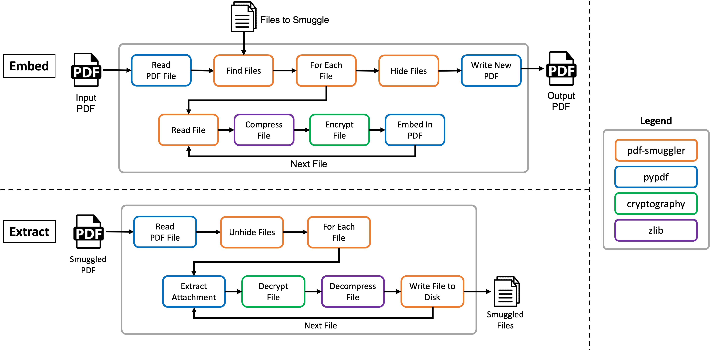

# Cycle 6: PDF Smuggler


## Requirements
The main requirements of the project that influenced the functionality and design are as follows:

TBD

## Design
TBD



## Video
A demonstration video can be found on YouTube here:

[https://youtu.be/TBD](https://youtu.be/TBD)


## Dependencies and Setup
The project has the following dependencies:

* [Python 3](https://www.python.org/): >= 3.11.x
* [Pip](https://pip.pypa.io/en/stable/): >= 23.0


### Python Dependencies
Install the Python dependencies using the following command:

```bash
pip install -r requirements.txt
```

## Usage
This section shows the usage of the tool:

### Help
The program help can be shown using the `-h` flag.

```bash
usage: pdf-smuggler.py [-h] -p PDF [-f FILES] [-d DIRS] [--no-hide] [--no-compression] [-k KEY] -o OUTPUT {embed,extract}

This program embeds hidden files within a PDF in support of data exfiltration.

positional arguments:
  {embed,extract}       Specifies the action to perform.

options:
  -h, --help            show this help message and exit
  -p PDF, --pdf PDF     The PDF file to read from
  -f FILES, --file FILES
                        Selects a file to embed in the PDF
  -d DIRS, --dir DIRS   Selects a directory of files (non-recursive) to embed in the PDF
  --no-hide             Disables hiding the embedded files, such that they will show up in a PDF viewer.
  --no-compression      Disables compressing the embedded files.
  -k KEY, --key KEY     Provides an encryption key to encrypt the embedded files and their file names.
  -o OUTPUT, --output OUTPUT
                        Where to write output to. When embedding, the output PDF. When extracting, the directory to extract files to.
```


### Embedding Files
You can embed files into a source PDF using these examples.

**Embedding File**
```bash
./pdf-smuggler.py embed \
  --input examples/pdfs/f1040.pdf \
  --file examples/files/file_to_embed.txt \
  --file examples/files/skull.png \
  --key "my key" \
  --output work/out.pdf
```

**Embedding A Director**

```bash
./pdf-smuggler.py embed \
  --input examples/pdfs/f1040.pdf \
  --dir examples/files/ \
  --key "my key" \
  --output work/out.pdf
```

**No Compression, Hiding of Files, or Encryption**
```bash
./pdf-smuggler.py embed \
  --input examples/pdfs/f1040.pdf \
  --dir examples/files/ \
  --no-hide \
  --no-compression \
  --output work/out.pdf
```


## Extracting Files
The following command will extract files from a PDF.

```bash
./pdf-smuggler.py extract \
  --input work/out.pdf \
  --key "my key" \
  --output work/extracted
```
