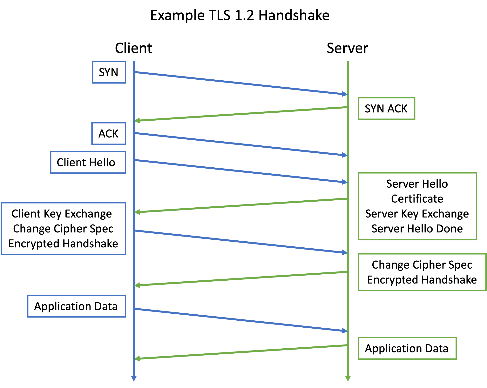
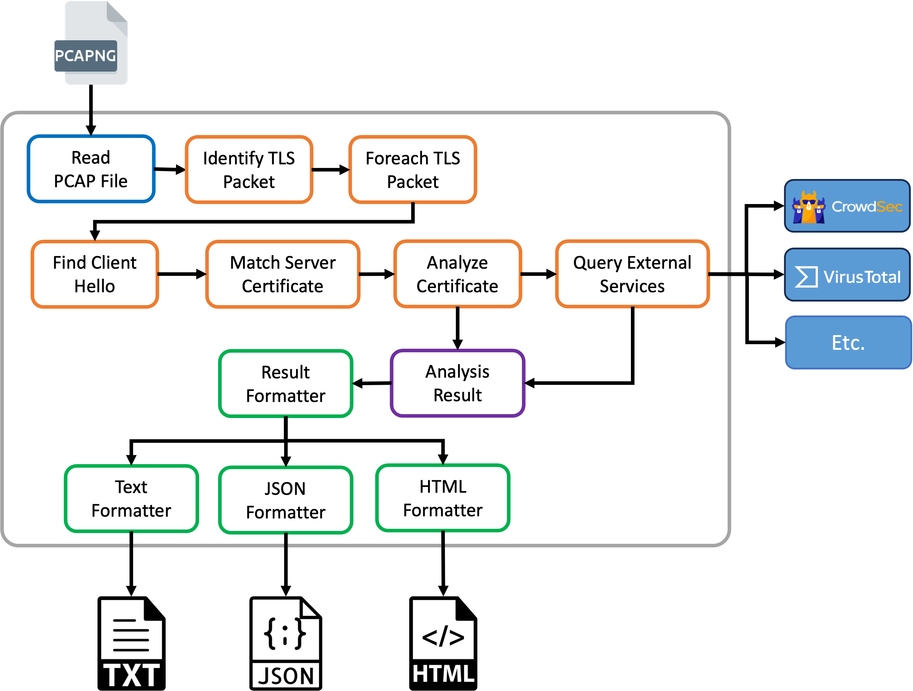

# Cycle 8: TLS Certificate Analyzer
The **TLS Certificate Analyzer** is a command line tool developed in Python focused on locating certificates within a TLS exchange that have issues such as:

* Self-signed certificates
* Expired certificates
* Certificates whose CN does not match the requested hostname
* Certificates with weak algorithms
* Certificates with an untrusted intermediate or root certificate
* Etc.

The tool operates on packet captures in the PACP / PACPNG format.  [tshark](https://www.wireshark.org/docs/man-pages/tshark.html) is used as the underlying packet parsing engine.  The [pyshark](https://github.com/KimiNewt/pyshark) Python bindings for tshark are used to work with tshark from Python.

The tool will interrogate PCAP files looking for TLS traffic. Once a TLS stream is found, the certificates are extracted from the TLS Handshake.  The certificates are then inspected for issues, and a report is generated.  External threat intelligence services (like CrowdSec and VirusTotal) are queried to get additional information on the server the certificate came from.

## Requirements
The main requirements of the project that influenced the functionality and design are as follows:

  * Accept a PCAP file as input.
  * Locate TLS Handshake within the packet capture
  * Extract server certificates from the TLS Handshake
  * Examine the certificates and identify validation errors.
  * Integrate with threat intelligence sites to gather additional information a hostnames / IP addresses to help judge if invalid certificates are associated with malicious intent.
  * Generate reports to present the results to the user.
  * Output formats should support both human-readable formats for presentation to the user, as well as machine-readable formats that can be ingested by other tools.

## Design

### TLS
The TLS v1.2 Handshake process is shown below.  The two most relevant messages are the Client Hello and the Certificate (from the server).  

<div align="center">
  
</div>

The Client Hello is important because it generally will contain the [Server Name Identification](https://en.wikipedia.org/wiki/Server_Name_Indication) (SNI) TLS Extension.  SNI adds the hostname that the client intends to communicate within the Client Hello message.  This is important since otherwise, proxies and firewalls might not know where to forward traffic to. For example, the hostname will typically be included in an HTTP Header. But this is application data, and would be encrypted once the TLS Session is established.  Thus SNI was added to TLS to communicate the intended hostname prior to standing up the encryption.  If we are to validate the requested hostname against the certificate, then we need to grab the hostname from the Client Hello Message.

Between the Server Hello and Server Hello Done messages, the server will respond with a Certificate within the handshake.  It is from this message that we can extract the server's SSL Certificate.  An interesting facet of TLS, is that multiple messages might be embedded in the same TCP packet, or they may be spread across different packets.  So the message that carries the ServerHello, may sometimes contain the Certificate message as well, whereas in other circumstances it may be in a subsequent packet.

### Architecture
The tool was developed in Python for expediency's sake.  A PCAP file is specified on the command line.  TShark is then used to load and iterate of the packet capture.  The tool looks for any TLS Packets and identifies Client Hello packets. The hostname is extracted from the Client Hello and stored in a map that associates the source IP/Port and the Destination IP/Port with the hostname for that request.  The tool then scans for the corresponding server certificate response.  The Certificate is extracted and analyzed.

If the user has supplied API keys for external threat intelligence services, then those services are queried.  The results for all certificates are aggregated and the report formatter outputs the results, in the specified format, to either standard out or a file of the users choosing.



## Video
A demonstration video can be found on YouTube here:

[https://youtu.be/TBD](https://youtu.be/TBD)


## Dependencies and Setup
The project has the following dependencies:

* [Python 3](https://www.python.org/): >= 3.11.x
* [Pip](https://pip.pypa.io/en/stable/): >= 23.0
* [pyshark](https://pypi.org/project/pyshark/): => 0.6


### Python Dependencies
Install the Python dependencies using the following command:

```bash
pip install -r requirements.txt
```

## Usage
This section shows the usage of the tool:

### Help
The program help can be shown using the `-h` flag.

```bash
tls-analyzer.py -h
usage: tls-analyzer [-h] -p PCAP [-c CONFIG] [-f {text,json,html}] [-o OUTPUT] [-v]

A utility for finding anomalies in TLS within a PCAP file.

options:
  -h, --help            show this help message and exit
  -p PCAP, --pcap PCAP  The pcap file to read from
  -c CONFIG, --config CONFIG
                        Overrides the default config file name
  -f {text,json,html}, --format {text,json,html}
                        Specifies the output format
  -o OUTPUT, --output OUTPUT
                        Saves output to a file instead of standard out
  -v, --verbose         Triggers additional output while processing the pcap
```

### example
An example run of the tool might look like this:

```bash
./tls-analyzer.py -p pcaps/badssl.com.pcapng --format html --output report.html 
```

This will use the `pcaps/badssl.com.pcapng` as input, generate an HTML report, and save it to the `report.html` file.

## Config File
The tool will accept a config file that allows setting credentials for the various threat intelligence services that can be queried.  By default, The tool looks for the `config.yml` file in the current directory.  The `--config` option can be used to specify an alternate filename.

The config file is structured as follows:

```yaml
# An API Key for CrowdSec (https://www.crowdsec.net/)
crowd_sec_api_key: "<insert-api-key-here>"

# An API Key for Virus Total (https://www.virustotal.com/)
virus_total_api_key: "<insert-api-key-here>"
```
